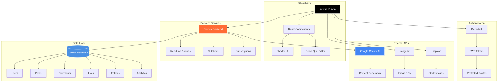
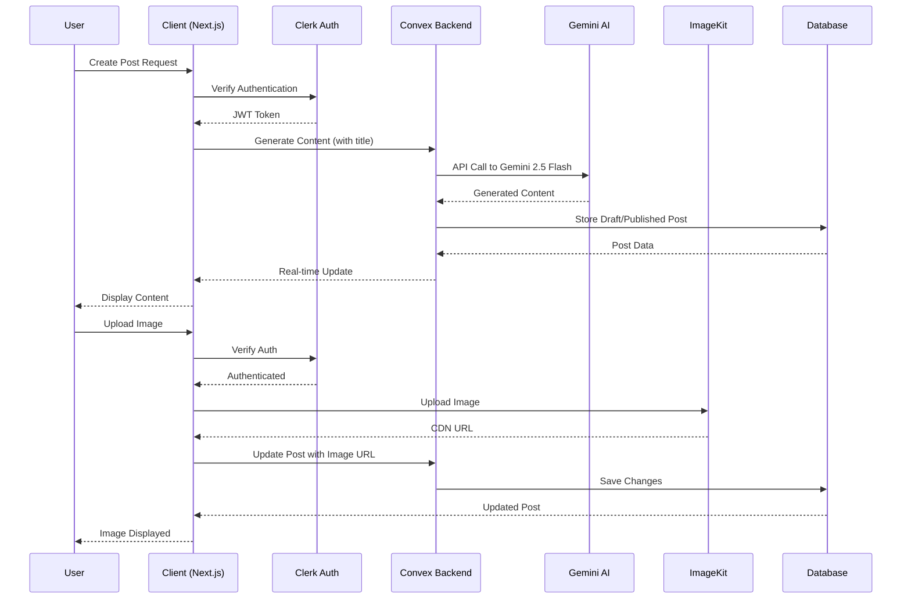
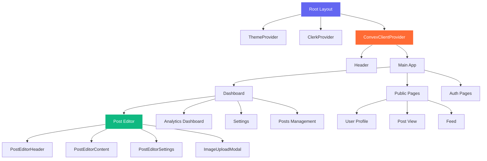
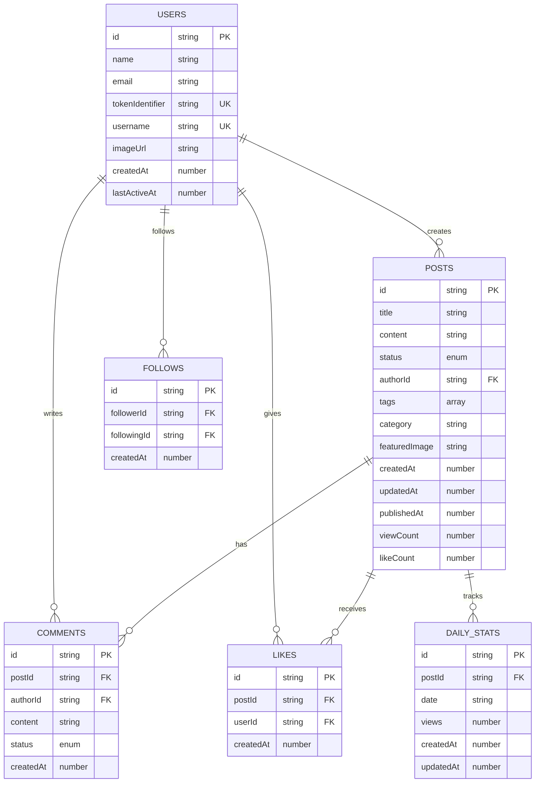

# AI Content Creator Platform 🚀

> A production-ready, full-stack content creation platform powered by AI. Create, publish, and grow your audience with intelligent content generation, real-time collaboration, and comprehensive analytics.

[](https://nextjs.org/)
[](https://react.dev/)
[](https://convex.dev/)
[](https://www.typescriptlang.org/)

---

## 📋 Table of Contents

- [Overview](#overview)
- [Architecture](#architecture)
- [Features](#features)
- [Tech Stack](#tech-stack)
- [Project Structure](#project-structure)
- [Database Schema](#database-schema)
- [Getting Started](#getting-started)
- [Environment Variables](#environment-variables)
- [API Documentation](#api-documentation)
- [Deployment](#deployment)
- [Contributing](#contributing)
- [License](#license)

---

## 🎯 Overview

The AI Content Creator Platform is a modern, scalable content management system that combines the power of AI with intuitive user experience. It enables creators to generate, edit, publish, and manage blog content with AI assistance, track performance through analytics, and build an engaged community through social features.

### Key Capabilities

- **AI-Powered Content Generation**: Leverage Google's Gemini 2.5 Flash to generate high-quality blog content from titles
- **Rich Text Editor**: Create beautiful content with React Quill's WYSIWYG editor
- **Image Management**: Seamless image uploads and transformations via ImageKit
- **Real-time Collaboration**: Live updates and real-time data synchronization with Convex
- **Social Features**: Follow system, likes, comments, and engagement tracking
- **Analytics Dashboard**: Comprehensive insights into content performance and audience engagement
- **Public Profiles**: Customizable user profiles with unique usernames

---

## 🏗️ Architecture

### System Architecture Diagram



### Data Flow Architecture



### Component Hierarchy



---

## ✨ Features

### 🤖 AI Content Generation
- **Smart Content Creation**: Generate comprehensive blog posts from just a title
- **Content Enhancement**: Expand, simplify, or enhance existing content with AI
- **SEO Optimization**: AI-powered suggestions for better content structure
- **Category & Tag Support**: Context-aware generation based on categories and tags

### 📝 Advanced Editor
- **Rich Text Editing**: Full-featured WYSIWYG editor with formatting options
- **Draft Management**: Auto-save drafts and resume editing anytime
- **Image Embedding**: Upload and embed images directly in posts
- **Unsplash Integration**: Search and add stock images seamlessly

### 🖼️ Image Management
- **ImageKit Integration**: Optimized image delivery with CDN
- **Smart Uploads**: Secure server-side image uploads
- **Image Transformations**: Resize, crop, and optimize images on-the-fly
- **Featured Images**: Set custom featured images for posts

### 📊 Analytics & Insights
- **View Tracking**: Real-time view counts per post
- **Engagement Metrics**: Track likes, comments, and shares
- **Daily Statistics**: Historical data visualization with charts
- **Performance Dashboard**: Comprehensive analytics for all content

### 👥 Social Features
- **Follow System**: Follow creators and build your audience
- **Likes & Comments**: Engage with content through likes and threaded comments
- **Public Profiles**: Customizable profiles with unique usernames
- **Content Feed**: Discover trending content and new creators

### 🎨 User Experience
- **Dark Mode**: Beautiful dark theme with system preference detection
- **Responsive Design**: Mobile-first design that works on all devices
- **Real-time Updates**: Live synchronization without page refreshes
- **Loading States**: Smooth loading indicators and skeleton screens

---

## 🛠️ Tech Stack

### Frontend
- **Next.js 15.4.6**: React framework with App Router and Server Components
- **React 19.1.0**: Latest React with concurrent features
- **Tailwind CSS 4**: Utility-first CSS framework
- **Shadcn UI**: High-quality component library
- **React Quill**: Rich text editor for content creation
- **Chart.js**: Data visualization for analytics
- **React Hook Form**: Performant form management
- **Zod**: Schema validation

### Backend
- **Convex**: Real-time backend with automatic API generation
- **Clerk**: Authentication and user management
- **Google Gemini AI 2.5 Flash**: AI content generation
- **ImageKit**: Image CDN and transformation service
- **Unsplash API**: Stock image search

### Development Tools
- **TypeScript**: Type-safe development (via Convex)
- **ESLint**: Code linting and quality
- **Turbopack**: Fast bundler for development

---

## 📁 Project Structure

```
ai-creator-platform/
├── app/                          # Next.js App Router
│   ├── (auth)/                   # Authentication routes
│   │   ├── sign-in/              # Sign-in page
│   │   └── sign-up/              # Sign-up page
│   ├── (public)/                 # Public routes
│   │   ├── [username]/           # User profile pages
│   │   │   ├── [postId]/         # Individual post pages
│   │   │   └── page.jsx          # Profile page
│   │   └── feed/                 # Content feed
│   ├── actions/                  # Server actions
│   │   └── gemini.js             # AI content generation
│   ├── api/                      # API routes
│   │   └── imagekit/             # Image upload endpoint
│   ├── dashboard/                # Protected dashboard routes
│   │   ├── create/               # Create new post
│   │   ├── posts/                # Manage posts
│   │   │   └── edit/[id]/        # Edit existing post
│   │   ├── followers/            # Followers management
│   │   ├── settings/             # User settings
│   │   └── page.jsx              # Dashboard home
│   ├── layout.js                 # Root layout
│   ├── page.js                   # Landing page
│   └── globals.css               # Global styles
│
├── components/                   # React components
│   ├── ui/                       # Shadcn UI components
│   │   ├── button.jsx
│   │   ├── card.jsx
│   │   ├── dialog.jsx
│   │   └── ...
│   ├── post-editor.jsx           # Main post editor
│   ├── post-editor-header.jsx    # Editor header
│   ├── post-editor-content.jsx   # Editor content area
│   ├── post-editor-settings.jsx  # Editor settings panel
│   ├── image-upload-modal.jsx    # Image upload UI
│   ├── daily-views-chart.jsx     # Analytics chart
│   └── header.jsx                # App header
│
├── convex/                       # Convex backend
│   ├── schema.js                 # Database schema
│   ├── users.js                  # User mutations/queries
│   ├── posts.js                  # Post CRUD operations
│   ├── comments.js               # Comment system
│   ├── likes.js                  # Like system
│   ├── follows.js                # Follow system
│   ├── dashboard.js              # Analytics queries
│   ├── feed.js                   # Public feed queries
│   ├── public.js                 # Public post queries
│   └── auth.config.js            # Clerk integration
│
├── hooks/                        # Custom React hooks
│   ├── use-convex-query.js       # Convex query hook
│   └── use-store-user.jsx        # User storage hook
│
├── lib/                          # Utility libraries
│   ├── utils.js                  # General utilities
│   ├── imagekit.js               # ImageKit configuration
│   └── data.js                   # Static data
│
├── public/                       # Static assets
│   ├── logo.png
│   ├── banner.png
│   └── placeholder.png
│
├── middleware.js                 # Next.js middleware (auth)
├── package.json                  # Dependencies
├── next.config.mjs               # Next.js configuration
├── tailwind.config.js            # Tailwind configuration
└── README.md                     # This file
```

---

## 🗄️ Database Schema

### Entity Relationship Diagram



### Schema Details

#### Users Table
- **Purpose**: Store user account information synced with Clerk
- **Key Fields**: `tokenIdentifier` (Clerk ID), `username` (unique)
- **Indexes**: By token, email, username
- **Search**: Name and email search indexes

#### Posts Table
- **Purpose**: Store blog posts and articles
- **Key Fields**: `status` (draft/published), `authorId`, `viewCount`, `likeCount`
- **Indexes**: By author, status, published date, author+status
- **Search**: Full-text search on title

#### Comments Table
- **Purpose**: Store comments on posts
- **Key Fields**: `status` (approved/pending/rejected), `postId`, `authorId`
- **Indexes**: By post, post+status, author
- **Features**: Supports anonymous comments

#### Likes Table
- **Purpose**: Track user likes on posts
- **Key Fields**: `postId`, `userId`
- **Indexes**: By post, user, post+user (prevents duplicates)
- **Features**: Supports anonymous likes

#### Follows Table
- **Purpose**: Track user follow relationships
- **Key Fields**: `followerId`, `followingId`
- **Indexes**: By follower, following, relationship (prevents duplicates)

#### Daily Stats Table
- **Purpose**: Store daily analytics per post
- **Key Fields**: `postId`, `date` (YYYY-MM-DD), `views`
- **Indexes**: By post, date, post+date (unique constraint)

---

## 🚀 Getting Started

### Prerequisites

- **Node.js** 18.17 or higher
- **npm** or **yarn** package manager
- Accounts for:
  - [Convex](https://convex.dev) (Backend as a Service)
  - [Clerk](https://clerk.com) (Authentication)
  - [ImageKit](https://imagekit.io) (Image CDN)
  - [Google AI Studio](https://makersuite.google.com/app/apikey) (Gemini API)
  - [Unsplash](https://unsplash.com/developers) (Optional - Stock Images)

### Installation

1. **Clone the repository**
   ```bash
   git clone https://github.com/yourusername/ai-creator-platform.git
   cd ai-creator-platform
   ```

2. **Install dependencies**
   ```bash
   npm install
   # or
   yarn install
   ```

3. **Set up Convex**
   ```bash
   npx convex dev
   ```
   This will:
   - Create a new Convex deployment
   - Generate the necessary files
   - Provide you with `NEXT_PUBLIC_CONVEX_URL` and `CONVEX_DEPLOYMENT`

4. **Configure Environment Variables**
   
   Create a `.env.local` file in the root directory:
   ```env
   # Convex Configuration
   CONVEX_DEPLOYMENT=your_deployment_name
   NEXT_PUBLIC_CONVEX_URL=https://your-deployment.convex.cloud

   # Clerk Authentication
   NEXT_PUBLIC_CLERK_PUBLISHABLE_KEY=pk_test_...
   CLERK_SECRET_KEY=sk_test_...
   NEXT_PUBLIC_CLERK_SIGN_IN_URL=/sign-in
   NEXT_PUBLIC_CLERK_SIGN_UP_URL=/sign-up
   CLERK_JWT_ISSUER_DOMAIN=your-domain.clerk.accounts.dev

   # ImageKit (Image CDN)
   NEXT_PUBLIC_IMAGEKIT_PUBLIC_KEY=public_...
   NEXT_PUBLIC_IMAGEKIT_URL_ENDPOINT=https://ik.imagekit.io/your_id
   IMAGEKIT_PRIVATE_KEY=private_...

   # Unsplash (Optional - for stock images)
   NEXT_PUBLIC_UNSPLASH_ACCESS_KEY=your_access_key

   # Google Gemini AI
   GEMINI_API_KEY=your_gemini_api_key
   ```

5. **Configure Clerk**
   - Go to [Clerk Dashboard](https://dashboard.clerk.com)
   - Create a new application
   - Configure allowed callback URLs:
     - `http://localhost:3000`
     - Your production domain
   - Copy the API keys to `.env.local`

6. **Configure ImageKit**
   - Go to [ImageKit Dashboard](https://imagekit.io/dashboard)
   - Create a new account/project
   - Get your Public Key, Private Key, and URL Endpoint
   - Add to `.env.local`

7. **Get Gemini API Key**
   - Visit [Google AI Studio](https://makersuite.google.com/app/apikey)
   - Create a new API key
   - Add to `.env.local` as `GEMINI_API_KEY`

8. **Run the development server**
   ```bash
   npm run dev
   # or
   yarn dev
   ```

9. **Open your browser**
   Navigate to [http://localhost:3000](http://localhost:3000)

---

## 🔐 Environment Variables

### Required Variables

| Variable | Description | Example |
|----------|-------------|---------|
| `CONVEX_DEPLOYMENT` | Convex deployment identifier | `your-deployment` |
| `NEXT_PUBLIC_CONVEX_URL` | Convex backend URL | `https://xxx.convex.cloud` |
| `NEXT_PUBLIC_CLERK_PUBLISHABLE_KEY` | Clerk public API key | `pk_test_...` |
| `CLERK_SECRET_KEY` | Clerk secret key | `sk_test_...` |
| `CLERK_JWT_ISSUER_DOMAIN` | Clerk JWT issuer domain | `xxx.clerk.accounts.dev` |
| `NEXT_PUBLIC_IMAGEKIT_PUBLIC_KEY` | ImageKit public key | `public_...` |
| `NEXT_PUBLIC_IMAGEKIT_URL_ENDPOINT` | ImageKit URL endpoint | `https://ik.imagekit.io/xxx` |
| `IMAGEKIT_PRIVATE_KEY` | ImageKit private key | `private_...` |
| `GEMINI_API_KEY` | Google Gemini API key | `AIza...` |

### Optional Variables

| Variable | Description | Example |
|----------|-------------|---------|
| `NEXT_PUBLIC_UNSPLASH_ACCESS_KEY` | Unsplash API access key | `xxx` |
| `NEXT_PUBLIC_CLERK_SIGN_IN_URL` | Custom sign-in URL | `/sign-in` |
| `NEXT_PUBLIC_CLERK_SIGN_UP_URL` | Custom sign-up URL | `/sign-up` |

---

## 📡 API Documentation

### Convex Queries & Mutations

#### Users

```javascript
// Store/Update user from Clerk
api.users.store() // mutation

// Get current authenticated user
api.users.getCurrentUser() // query

// Update username
api.users.updateUsername({ username: string }) // mutation

// Search users
api.users.search({ query: string }) // query
```

#### Posts

```javascript
// Create new post
api.posts.create({
  title: string,
  content: string,
  category?: string,
  tags: string[],
  featuredImage?: string,
  status: "draft" | "published"
}) // mutation

// Update existing post
api.posts.update({
  id: Id<"posts">,
  title?: string,
  content?: string,
  // ... other fields
}) // mutation

// Get user's posts
api.posts.getUserPosts() // query

// Get user's draft
api.posts.getUserDraft() // query

// Get published posts
api.posts.getPublished({ limit?: number }) // query

// Get post by ID
api.posts.getById({ postId: Id<"posts"> }) // query

// Increment view count
api.posts.incrementView({ postId: Id<"posts"> }) // mutation
```

#### Comments

```javascript
// Add comment
api.comments.add({
  postId: Id<"posts">,
  content: string,
  authorName: string,
  authorEmail?: string
}) // mutation

// Get comments for post
api.comments.getByPost({ postId: Id<"posts"> }) // query
```

#### Likes

```javascript
// Toggle like
api.likes.toggle({ postId: Id<"posts"> }) // mutation

// Get like count
api.likes.getCount({ postId: Id<"posts"> }) // query

// Check if user liked
api.likes.hasLiked({ postId: Id<"posts"> }) // query
```

#### Follows

```javascript
// Follow/Unfollow user
api.follows.toggle({ followingId: Id<"users"> }) // mutation

// Get followers
api.follows.getFollowers({ userId: Id<"users"> }) // query

// Get following
api.follows.getFollowing({ userId: Id<"users"> }) // query
```

#### Dashboard

```javascript
// Get analytics
api.dashboard.getAnalytics() // query

// Get daily stats
api.dashboard.getDailyStats({ postId: Id<"posts"> }) // query
```

### Server Actions

#### Gemini AI Content Generation

```javascript
// Generate blog content
generateBlogContent(
  title: string,
  category?: string,
  tags?: string[]
) // Returns: { success: boolean, content?: string, error?: string }

// Improve content
improveContent(
  currentContent: string,
  improvementType?: "expand" | "simplify" | "enhance"
) // Returns: { success: boolean, content?: string, error?: string }
```

### API Routes

#### Image Upload

```
POST /api/imagekit/upload
Content-Type: multipart/form-data

Body:
- file: File
- fileName: string (optional)

Response:
{
  success: boolean,
  url: string,
  fileId: string,
  width: number,
  height: number,
  size: number,
  name: string
}
```

---

## 🚢 Deployment

### Deploying to Vercel (Recommended)

1. **Push your code to GitHub**
   ```bash
   git add .
   git commit -m "Prepare for deployment"
   git push origin main
   ```

2. **Import project to Vercel**
   - Go to [Vercel Dashboard](https://vercel.com/dashboard)
   - Click "New Project"
   - Import your GitHub repository

3. **Configure Environment Variables**
   - Add all environment variables from `.env.local`
   - Set production Clerk URLs
   - Set production Convex deployment URL

4. **Deploy**
   - Vercel will automatically deploy on push to main
   - Or click "Deploy" in the dashboard

### Deploying Convex

1. **Deploy Convex backend**
   ```bash
   npx convex deploy
   ```

2. **Get production URL**
   - Copy `NEXT_PUBLIC_CONVEX_URL` from Convex dashboard
   - Add to Vercel environment variables

### Post-Deployment Checklist

- [ ] Update Clerk callback URLs with production domain
- [ ] Verify all environment variables are set
- [ ] Test authentication flow
- [ ] Test image uploads
- [ ] Verify AI content generation
- [ ] Check analytics tracking
- [ ] Test public profile pages
- [ ] Verify real-time updates

---

## 🧪 Development Workflow

### Running Locally

```bash
# Start Convex backend
npx convex dev

# In another terminal, start Next.js
npm run dev
```

### Building for Production

```bash
# Build the application
npm run build

# Start production server
npm start
```

### Code Quality

```bash
# Run ESLint
npm run lint
```

---

## 🤝 Contributing

We welcome contributions! Please follow these steps:

1. **Fork the repository**
2. **Create a feature branch**
   ```bash
   git checkout -b feature/amazing-feature
   ```
3. **Make your changes**
4. **Commit your changes**
   ```bash
   git commit -m 'Add amazing feature'
   ```
5. **Push to the branch**
   ```bash
   git push origin feature/amazing-feature
   ```
6. **Open a Pull Request**

### Code Style Guidelines

- Use ESLint configuration provided
- Follow React best practices
- Write meaningful commit messages
- Add comments for complex logic
- Update documentation for new features

---

## 📝 License

This project is licensed under the MIT License - see the LICENSE file for details.

---

## 🙏 Acknowledgments

- [Next.js](https://nextjs.org/) - The React Framework
- [Convex](https://convex.dev/) - Real-time Backend
- [Clerk](https://clerk.com/) - Authentication
- [Shadcn UI](https://ui.shadcn.com/) - UI Components
- [Google Gemini](https://ai.google.dev/) - AI Content Generation
- [ImageKit](https://imagekit.io/) - Image CDN

---

## 📞 Support

For support, email support@yourdomain.com or open an issue on GitHub.

---

## 🗺️ Roadmap

- [ ] Scheduled publishing
- [ ] Email notifications
- [ ] Advanced analytics
- [ ] Content templates
- [ ] Multi-language support
- [ ] Export to PDF/Word
- [ ] SEO optimization tools
- [ ] Social media integration
- [ ] Content scheduling calendar
- [ ] Team collaboration features

---

**Built with ❤️ using Next.js, Convex, and AI**
